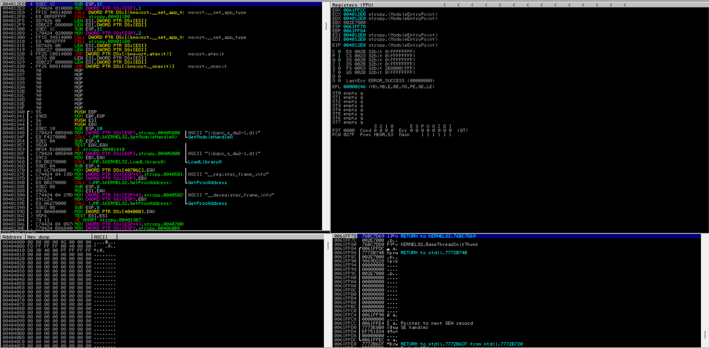
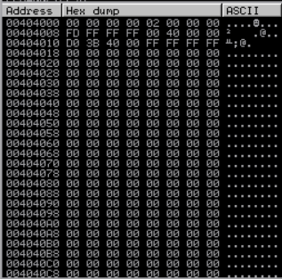
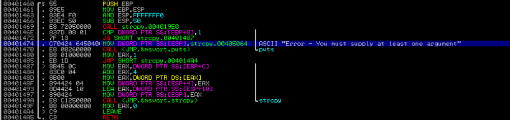

<div align='center'>

# **Introduction to Buffer Overflows**

</div>

## **Table of content**

- [**1. Introduction to the x86 Architecture**](#1-introduction-to-the-x86-architecture)
  - [**1.1. Program Memory**](#11-program-memory)
    - [**1.1.1 The Stack**](#111-the-stack)
    - [**1.1.2 Function Return Mechanics**](#112-function-return-mechanics)
  - [**1.2. CPU Registers**](#12-cpu-registers)
    - [**1.2.1 General Purpose Registers**](#121-general-purpose-registers)
    - [**1.2.2 ESP - The Stack Pointer**](#122-esp---the-stack-pointer)
    - [**1.2.3 EBP - The Base Pointer**](#123-ebp---the-base-pointer)
    - [**1.2.4 EIP - The Instruction Pointer**](#124-eip---the-instruction-pointer)
- [**2. Buffer Overflow Walkthrough**](#2-buffer-overflow-walkthrough)
  - [**2.1. Sample Vulnerable Code**](#21-sample-vulnerable-code)
  - [**2.2. Introducing the Immunity Debugger**](#22-introducing-the-immunity-debugger)
  - [**2.3. Navigating Code**](#23-navigating-code)
  - [**2.4. Overflowing the Buffer**](#24-overflowing-the-buffer)


## **1. Introduction to the x86 Architecture**

### **1.1. Program Memory**

When a binary application is executed, it allocates memory in a very specific way within the
memory boundaries used by modern computers. The memory is divided into several sections: Stack, Program Image, Process Environment Block (PEB), Thread Environment Block (TEB), and Heap.


#### **1.1.1 The Stack**

When a thread is running, it executes code from within the Program Image or from various Dynamic Link Libraries (DLLs). The thread requires a short-term data area for functions, local variables, and program control information, which is known as the stack

Stack memory is "viewed" by the CPU as a Last-In First-Out (LIFO) structure.

#### **1.1.2 Function Return Mechanics**

When code within a thread calls a function, it must know which address to return to once the function completes. This "return address" (along with the function’s parameters and local variables) is stored on the stack


When a function ends, the return address is taken from the stack and used to restore the execution flow back to the main program or the calling function.

### **1.2. CPU Registers**

To perform efficient code execution, the CPU maintains and uses a series of nine 32-bit registers
(on a 32-bit platform).


Each register may contain a 32-bit value (allowing values between 0 and 0xFFFFFFFF) or may contain 16-bit or 8-bit values in the respective subregisters


#### **1.2.1 General Purpose Registers**

Several registers, including EAX, EBX, ECX, EDX, ESI, and EDI are often-used as general purpose registers to store temporary data
- EAX (accumulator): Arithmetical and logical instructions
- EBX (base): Base pointer for memory addresses
- ECX (counter): Loop, shift, and rotation counter
- EDX (data): I/O port addressing, multiplication, and division
- ESI (source index): Pointer addressing of data and source in string copy operations
- EDI (destination index): Pointer addressing of data and destination in string copy operations

#### **1.2.2 ESP - The Stack Pointer**

A pointer is a reference to an address in memory

ESP, the stack pointer, keeps "track" of the most recently referenced location on the stack (top of the stack) by storing a pointer to it

#### **1.2.3 EBP - The Base Pointer**

EBP stores a pointer to the top of the stack
when a function is called. By accessing EBP, a function can easily reference information from its own stack frame (via offsets) while executing

#### **1.2.4 EIP - The Instruction Pointer**

EIP stores the address of the next instruction to be executed by the CPU

## **2. Buffer Overflow Walkthrough**

### **2.1. Sample Vulnerable Code**

```c
#include <stdio.h>
#include <string.h>
int main(int argc, char *argv[]) {
    char buffer[64];
    if (argc < 2) {
        printf("Error - You must supply at least one argument\n");
        return 1;
    }
    strcpy(buffer, argv[1]);
    return 0;
}
```

This program first defines a character array named buffer that can fit up to 64 characters. Since this variable is defined within a function, the C compiler will treat it as a local variable and will reserve space (64 bytes) for it on the stack. Specifically, this memory space will be reserved within the main function stack frame during its execution when the program runs.

The program then proceeds to copy (strcpy) the content of the given command-line argument (argv[1]) into the buffer character array.

Finally, the program terminates its execution and returns a zero (standard success exit code) to
the operating system.

If the argument passed to the main function is 64 characters or less, this program will work as expected and will exit normally. However, since there are no checks on the size of the input, if the argument is longer, say 80 bytes, part of the stack adjacent to the target buffer will be overwritten by the remaining 16 characters, overflowing the array boundaries.


### **2.2. Introducing the Immunity Debugger**

A debugger acts as a proxy between the application and the CPU, and it allows us to stop the execution flow at any time to inspect the content of the registers as well as the process memory space. While running an application through a debugger, we can also execute assembly instructions one at a time to better understand the detailed flow of the code

**Using Immunity Debugger**

Load the vulnerable program into Immunity Debugger by selecting File → Open and then selecting the vulnerable program from the file browser and pass 12 'A' character as the argument.




There are four main windows in Immunity Debugger:

- The upper left window shows the assembly code of the program


- The upper right window contains all the registers, including the two we are most interested in: ESP and EIP


- The lower right window shows the stack and its content. This view contains four columns: a memory address, the hex data residing at that address, an ASCII representation of the data, and a dynamic commentary that provides additional information related to a particular stack entry when available


- The lower left window shows the contents of memory at any given address. Similar to the stack window, it shows three columns including the memory address and the hex and ASCII representations of the data.



### **2.3. Navigating Code**

Execute instructions one at a time using the `Debug > Step` into or `Debug > Step` over commands. `Step into` will follow the execution flow into a given function call, while `Step over` will execute the entire function and return from it.

Search for the error message `Error - You must supply at least one argument` by right click inside the disassembly window and select `Search for > All referenced text strings` 


Double-clicking on that line, we return to the disassembly window, but this time inside the main function. From here we can also see the the call to `strcpy` function



Set a breakpoint on the `strcpy` function by selecting the line and pressing `F2`. A breakpoint is essentially an intentional pause that can be set by the debugger on any program instruction


When the program is executed, it will stop just before the call to the `strcpy` function and allow us to inspect the content of the registers and the stack


Execution has paused at the strcpy command (address 0x0040149A).EIP is set to this address as well since this points to the next instruction to be executed. In the stack window, we find the twelve 'A' characters from our command line input (src = 'AAAAAAAAAAAA'') and the address of the 64-byte buffer variable where these characters will be copied (dest = 0061FEE0).

Step into the `strcpy` function


We can double-click on the strcpy destination address (0x0061FEE0) in the stack pane to better monitor the memory write operations occurring at that address. we  can see relative (positive and negative) offsets in the left-hand column instead of real addresses


Since we defined a 64-byte buffer in our program (buffer[64]), our buffer extends from offset 0 to offset +40, including the null terminator for our character array

The return address 0x0040149F at the top of the stack. This is the address we will return to when the `strcpy` has completed

Let the program run until the `strcpy` function returns


`strcpy` has copied the twelve 'A' characters to the stack (into the buffer) and we are clearly within the 64-byte buffer limit imposed by the declared local buffer variable size

The address located at offset +4C (00401288) is the return address of the `main` function. This is the address that will be loaded into EIP when the `strcpy` function returns

When the `strcpy` function returns, the CPU will pop the return address from the stack (0040149F) and load it into EIP. This will cause the execution flow to return to the main function and continue its execution.

We arrive back at the main function address 0x0040149F since this is the next address after the `strcpy` call


The next instruction, `MOV EAX,0` is the equivalent of the return 0 in the `main` function.

The next instruction, `LEAVE`, puts the return address at offset 0x4C (from the beginning of our buffer local variable) onto the top of the stack. Then, the `RETN` assembly instruction pops the main function return address from the top of the stack and executes the code there


When `strcpy` copied the input string (12 bytes) from the command line argument to the stack buffer variable, it started to write at address 0x0061FEE0 and onwards

If we pass a longer string as an input to our program, enough data will be written to the stack and eventually we should be able to overwrite the return address of the main parent function located at offset 0x4C from the buffer variable

### **2.4. Overflowing the Buffer**

Load the vulnerable program into Immunity Debugger by selecting File → Open and then selecting the vulnerable program from the file browser and pass 80 'A' character as the argument.

Here is the stack window after the `strcpy` function has returned. We can see that the offset +4C which is the return address of the main function is overwritten with the 'A' characters


If we continue the execution and proceed to the RETN instruction in the main function, the overwritten return address will be popped into EIP   


Then the CPU tries to read the next instruction from 0x41414141. Since this is not a valid address in the process memory space, the CPU triggers an access violation, crashing the application

