<div align='center'>

# **Locating Public Exploits**

</div>

## **Table of Contents**

- [**1. A Word of Caution**](#1-a-word-of-caution)
- [**2. Searching for Exploits**](#2-searching-for-exploits)
    - [**2.1. Online Exploit Resources**](#21-online-exploit-resources)
        - [**2.1.1. Exploit Databases**](#211-exploit-databases)
        - [**2.1.2. Packet Storm**](#212-packet-storm)
        - [**2.1.3. Google Search Operators**](#213-google-search-operators)
    - [**2.2. Offline Exploit Resources**](#22-offline-exploit-resources)
        - [**2.2.1. SearchSploit**](#221-searchsploit)
        - [**2.2.2. Nmap NSE Scripts**](#212-nmap-nse-scripts)
        - [**2.2.3. The Browser Exploitation Framework (BeEF)**](#223-the-browser-exploitation-framework-beef)
        - [**2.2.4. The Metasploit Framework**](#224-the-metasploit-framework)

## **1. A Word of Caution**

It is important to understand that by downloading and running public exploits, we can greatly endanger any system that runs that code. With this in mind, we need to carefully read and understand the code before execution to ensure no negative effects

Example: [0pen0wn](https://domenicoluciani.com/2013/06/13/the-exploit-that-exploits-you.html) public exploit can potentially delete the home directory

If code inspection or compilation is too complex, set up a virtual machine with a clean snapshot as an exploit testing ground or "sandbox".

## **2. Searching for Exploits**

### **2.1. Online Exploit Resources**

#### **2.1.1. Exploit Databases**

[The Exploit Database](https://www.exploit-db.com/) is a project maintained by Offensive Security. It is a free archive of public exploits that are gathered through submissions, mailing lists, and public resources

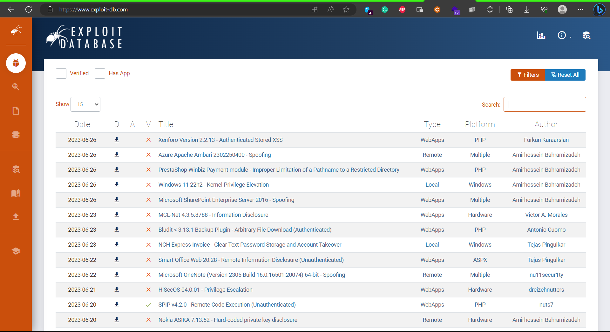

The Exploit Database can sometime provide the installer for the vulnerable version of the software for research purposes

#### **2.1.2. Packet Storm**

[Packet Storm](https://packetstormsecurity.com/) was established in 1998. It provides up-to-date information on security news and vulnerabilities as well as recently published tools by security vendors

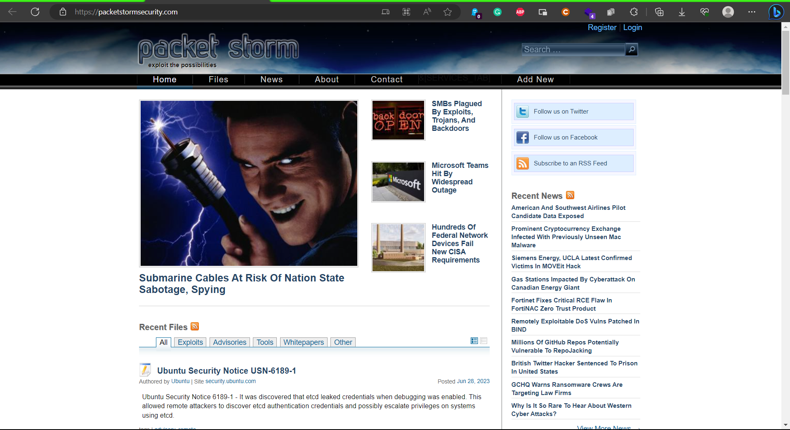

#### **2.1.3. Google Search Operators**

We can begin searching for a specific software and version followed by the exploit keyword and include various search operators (like those used by the Google search engine) to narrow our search

For example, searching for vulnerabilities affecting the Microsoft Edge browser and limit the results to only those exploits that are hosted on the Exploit Database website

```bash
firefox --search "Microsoft Edge site:exploit-db.com"
```

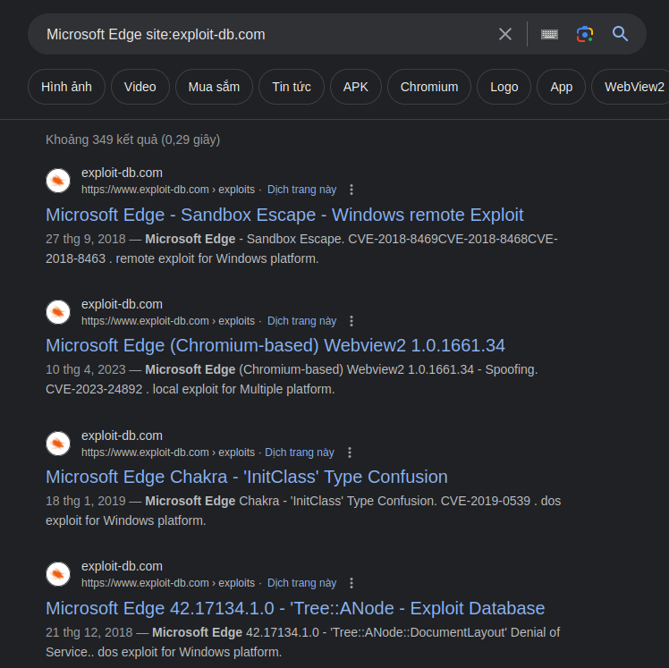

### **2.1. Offline Exploit Resources**

#### **2.1.1. SearchSploit**

The Exploit Database provides a downloadable archived copy of all the hosted exploit code. This archive is included by default in Kali in the exploitdb package

The archive is stored in `/usr/share/exploitdb/`. This directory is split in two major sections, exploits and shellcodes:

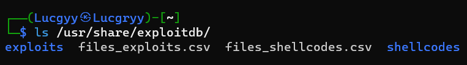

The exploits directory is further divided into separate directories for each operating system, architecture, and scripting language

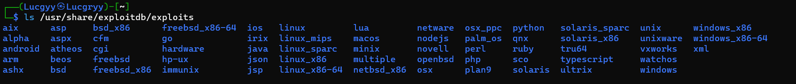

The searchsploit command-line utility is a wrapper for the Exploit Database archive. It allows us to search for exploits by keyword, software name, and CVE number

Search for all available remote exploits that target the SMB service on the Windows operating system

```bash
searchsploit remote smb microsoft windows
```

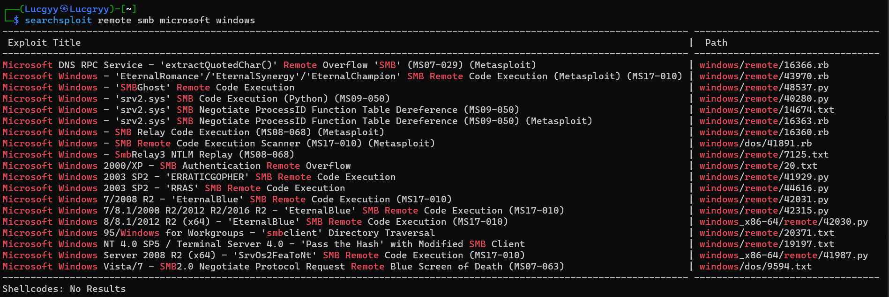

#### **2.1.2. Nmap NSE Scripts**

The Nmap Scripting Engine is used for automate various tasks using scripts

A complete list of scripts provided by the Nmap Scripting Engine can be found under `/usr/share/nmap/`scripts. Using grep to quickly search the NSE scripts for the word "Exploits" to find all scripts that are related to exploits

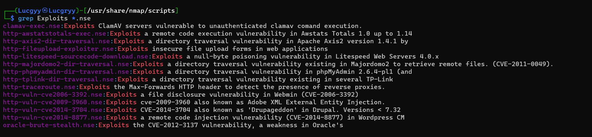

We can list information on specific NSE scripts by running nmap with the --script-help option followed by the script filename

```bash
nmap --script-help=clamav-exec.nse
```

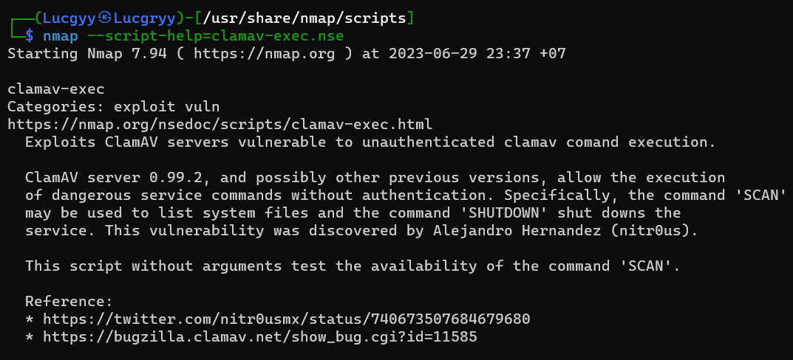

#### **2.1.3. The Browser Exploitation Framework (BeEF)**

The Browser Exploitation Framework (BeEF) is a penetration testing tool focused on client-side attacks executed within a web browser.

Activate BeEF by running the `beef-xss` command

Navigate to the BeEF web interface at `http://127.0.0.1:3000/ui/panel`

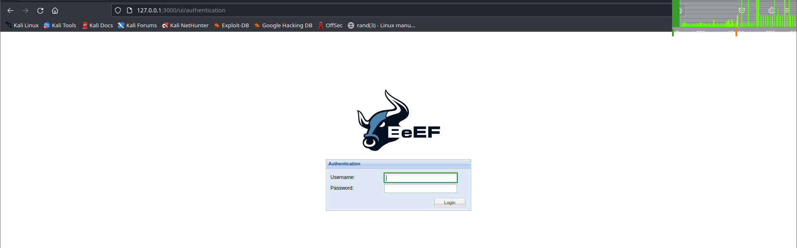

After logging in, we can see the BeEF dashboard

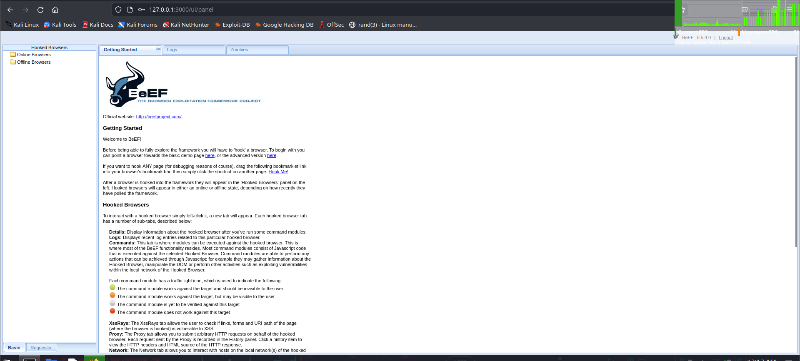

Use the demo page provided by the framework to hook our own browser

Once our browser is hooked, we can see the browser information and the various enumeration scripts and exploits

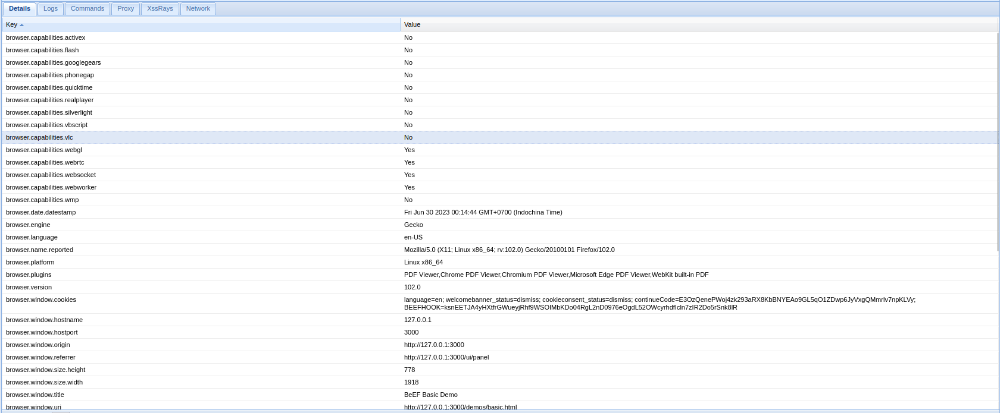

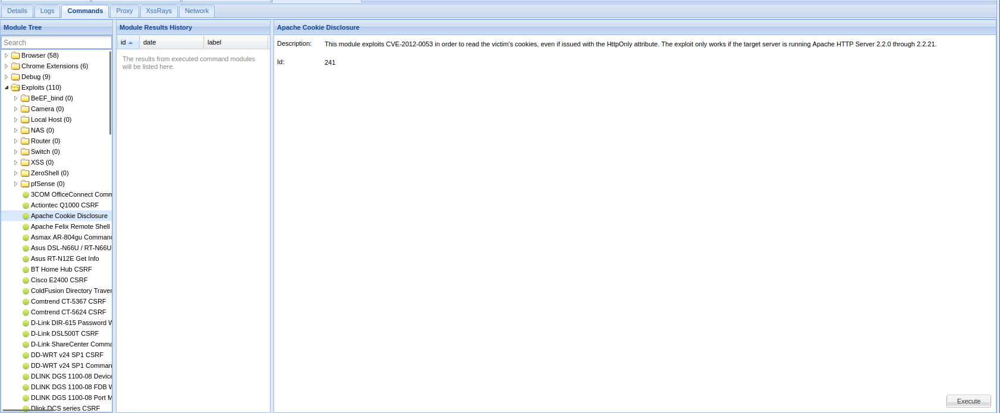

#### **2.1.4. The Metasploit Framework**

Metasploit is an excellent framework built to assist in the development and execution of exploits

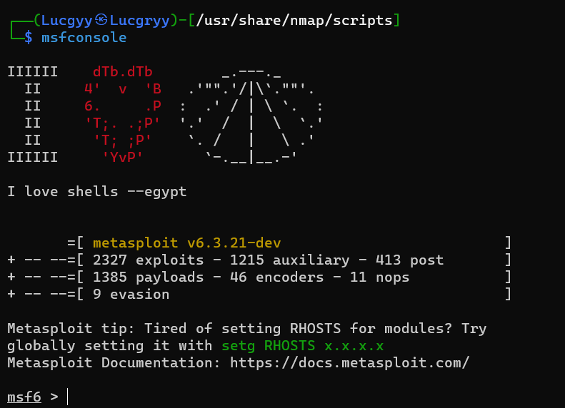

We can search for famous vulnerabilities [MS08_067](https://learn.microsoft.com/en-us/security-updates/securitybulletins/2008/ms08-067) using the search command

```bash
search ms08_067
```

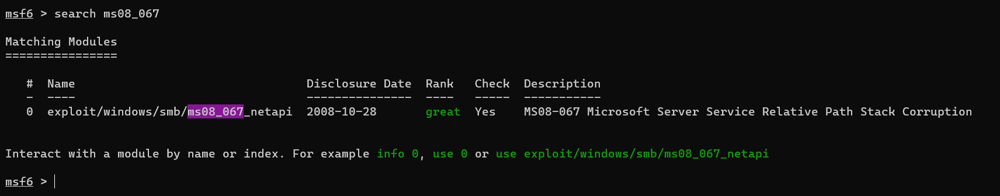

Metasploit's search command includes numerous keywords to help us find a particular exploit

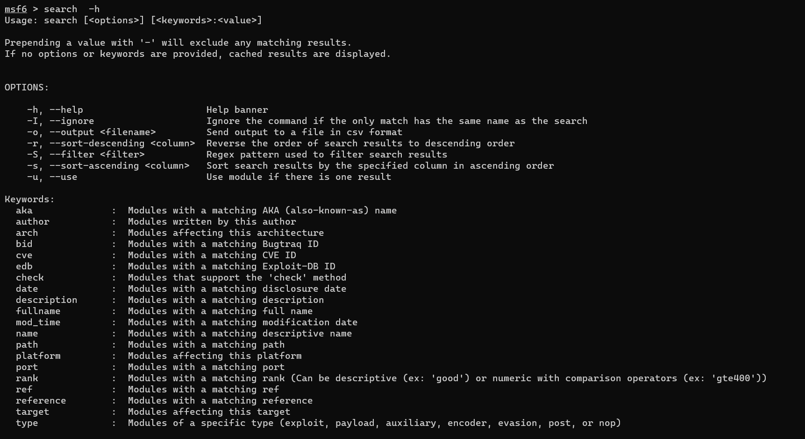