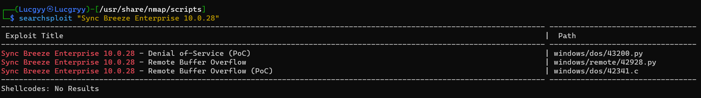
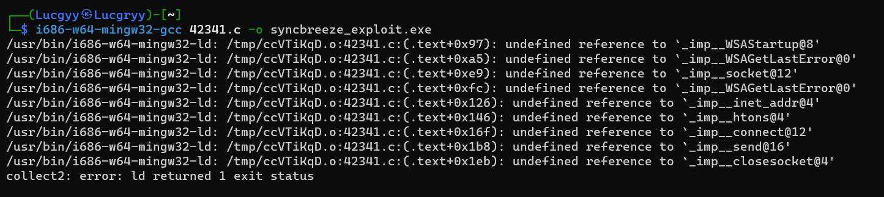
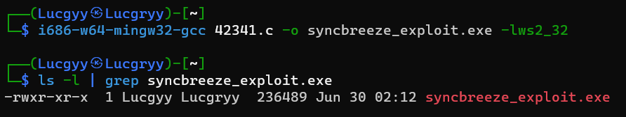
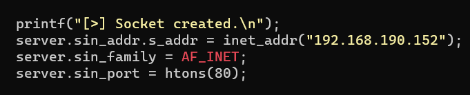
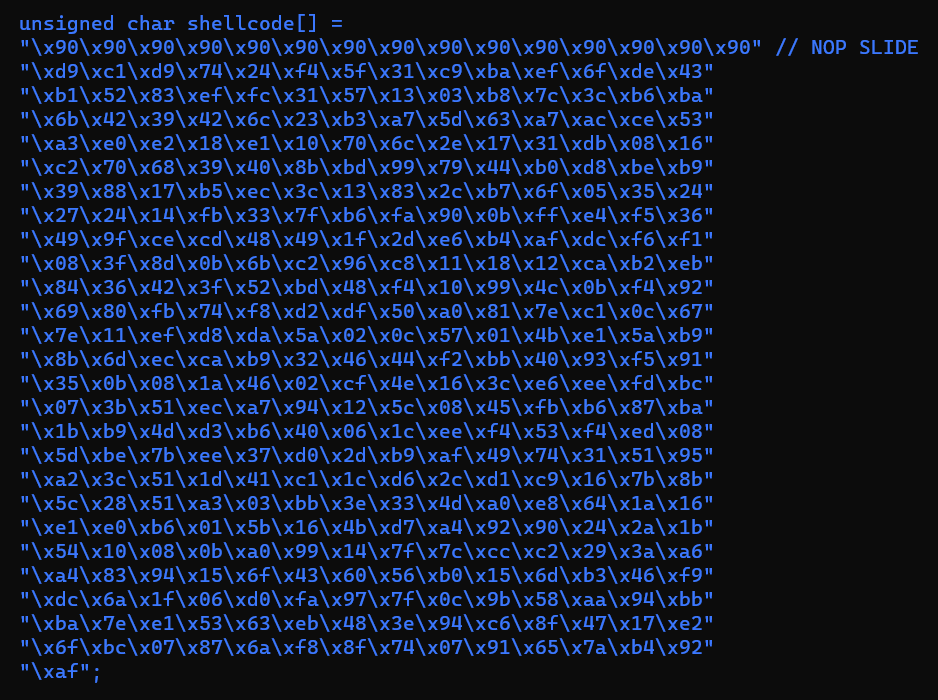
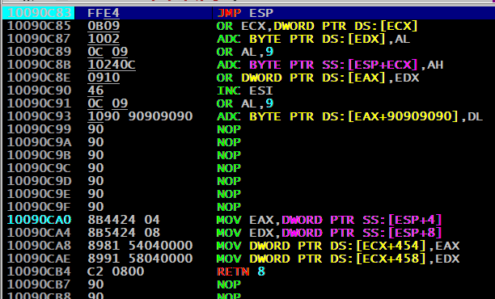
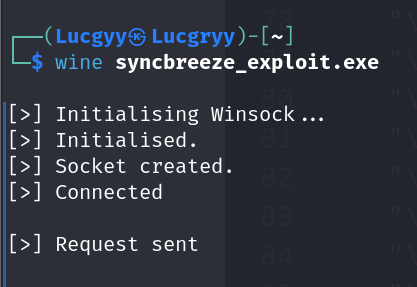
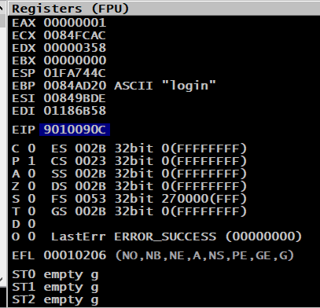
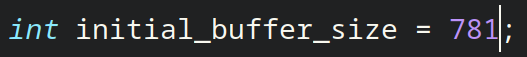
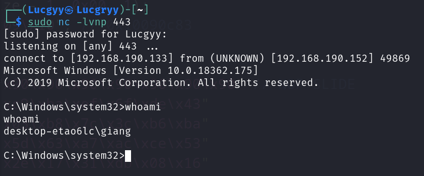

<div align='center'>

# **Fixing Exploits**

</div>

## **Table of Contents**

## **1. Fixing Memory Corruption Exploits**

### **1.1. Overview and Considerations**

The general flow of a standard stack overflow:

- Create a large buffer to trigger the overflow.
- Take control of EIP by overwriting a return address on the stack by padding the large buffer with an appropriate offset.
- Include a chosen payload in the buffer prepended by an optional NOP sled.
- Choose a correct return address instruction such as JMP ESP (or different register) in order to redirect the execution flow into our payload.

When fixing a exploit, we may need to modify elements of the deployed buffer to suit our target such as file paths, IP addresses and ports, URLs. If these modifications alter our offset, we must adjust the buffer length to ensure we overwrite the return address with the desired bytes

We can consider changing the payload contained in the original exploit code.

### **1.2. Importing and Examining the Exploit**

Vulnerable software: [Easy RM to MP3 Converter](https://www.exploit-db.com/exploits/42928)

Search for public exploits:

```bash
searchsploit "Sync Breeze Enterprise 10.0.28"
```



We find that there are two exploits available for this software, one is coded in Python and the other is coded in C. We will use the C exploit

Examing the C code, the header files are included which indicate that this code was meant to be compiled on Windows

### **1.3. Cross-Compiling Exploit Code**

Cross-compiling is the process of compiling code on one platform to be executed on another platform. In this case, we will compile the exploit code which was meant to be executed on Windows to be executed on Linux

We can use the `i686-w64-mingw32-gcc` compiler to compile the exploit code (install via `apt install mingw-w64`). However, the compilation is failed

```bash
i686-w64-mingw32-gcc 42341.c -o syncbreeze_exploit.exe
```



Searching for the error message, we find that the error is caused by the linker can not find the winsock library. We can fix this by adding the `-lws2_32` flag to the compiler

```bash
i686-w64-mingw32-gcc 42341.c -o syncbreeze_exploit.exe -lws2_32
```



### **1.4. Changing the Socket Information**



### **1.5. Changing the Return Address**

From [Chapter11](./Chapter11_Windows_Buffer_Overflows.md) we have found the target return address of the vulnerable function is `0x10090c83`. We can use this address to overwrite the return address in the exploit code


### **1.6. Changing the Payload**

Use the shellcode from [Chapter11](./Chapter11_Windows_Buffer_Overflows.md) and change the payload in the exploit code



The updated [exploit](./Scripts/Chapter15/exploit.c)

Recompile the exploit code

```bash
i686-w64-mingw32-gcc exploit.c -o syncbreeze_exploit.exe -lws2_32
```

In the Windows machine, attach the debugger to the vulnerable process, set a breakpoint at the `JMP ESP` instruction.



Run the exploit using `wine` command



The debugger is triggered and we can see that the EIP is overwritten with the return address `0x9010090c` which is off by one byte. We can fix this by adding a NOP sled to the payload



### **1.7. Changing the Overflow Buffer**

Here is how the buffer is constructed in the exploit code

```c
int initial_buffer_size = 780;
char *padding = malloc(initial_buffer_size);
memset(padding, 0x41, initial_buffer_size);
memset(padding + initial_buffer_size - 1, 0x00, 1);
...
char *buffer = malloc(buffer_length);
memset(buffer, 0x00, buffer_length);
strcpy(buffer, request_one);
strcat(buffer, content_length_string);
strcat(buffer, request_two);
strcat(buffer, padding);
strcat(buffer, retn);
strcat(buffer, shellcode);
strcat(buffer, request_three);
```

From [Chapter11](./Chapter11_Windows_Buffer_Overflows.md) we have found that the offset is 780 bytes. In the exploit code, firstly, the exploit allocates a buffer of 780 bytes and then fills it with A' characters and NULL bytes at the end. Secondly, the exploit allocating a memory block for the buffer character array and filling the array with NULL bytes. Next, the code fills the buffer character array by copying the content of the other variables through various string manipulation functions such as `strcpy` and `strcat`

However, `strcpy` and `strcat` determine the end and the size of a string by searching for the first occurrence of a NULL byte in the target character array. Since the allocation size of our initial padding buffer is 780, by setting the last byte to 0x00, we end up concatenating (strcat) a string of
779 "A" ASCII characters

We can fix this by changing the initial buffer size to 781



Recompile the exploit code and run it, we get a shell



## **2. Fixing Web Exploits**

When modifying web exploits, there are several key questions we generally need to ask while
approaching the code:
- Does it initiate an HTTP or HTTPS connection?
- Does it access a web application specific path or route?
- Does the exploit leverage a pre-authentication vulnerability?
- If not, how does the exploit authenticate to the web application?
- How are the GET or POST requests crafted to trigger and exploit the vulnerability?
- Does it rely on default application settings (such as the web path of the application) that may have been changed after installation?
- Will oddities such as self-signed certificates disrupt the exploit?

In addition, we must remember that public web application exploits do not take into account
additional protections such as `.htaccess`